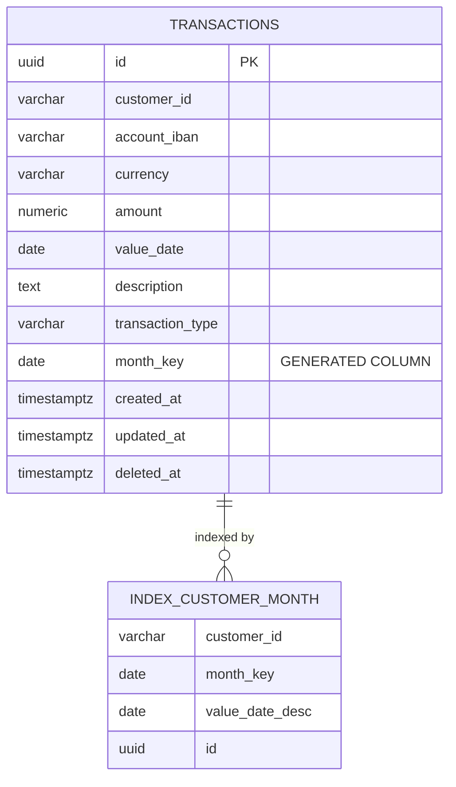
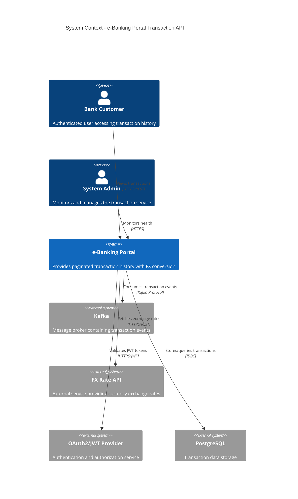
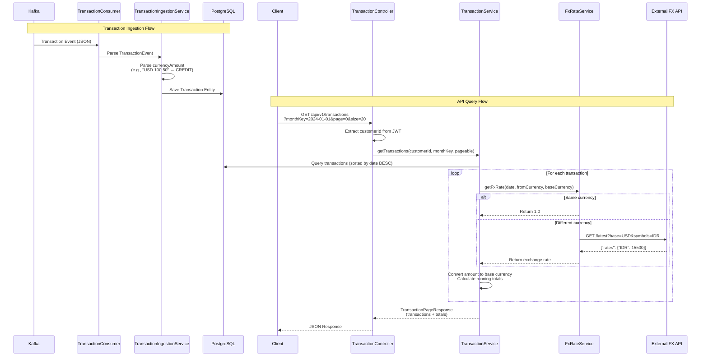

# e-Banking Portal Transaction API - Architecture & Implementation Decisions

## Overview

This document describes the architecture, design decisions, and implementation details for the e-Banking Portal Transaction API. The system provides a paginated REST API for retrieving customer transaction history with real-time currency conversion and page-level totals.

## Architecture Diagrams

### System Architecture
```mermaid
graph TB
    subgraph "External Systems"
        K[Kafka Broker<br/>Topic: transactions]
        FX[FX Rate API<br/>exchangerate.host]
        JWT[JWT Provider<br/>OAuth2/OIDC]
    end
    
    subgraph "e-Banking Portal API"
        subgraph "Web Layer"
            C[TransactionController<br/>GET /api/v1/transactions]
        end
        
        subgraph "Service Layer"
            TS[TransactionService<br/>Pagination + FX Conversion]
            TIS[TransactionIngestionService<br/>Parse & Store]
            FXS[FxRateService<br/>External Rate Lookup]
        end
        
        subgraph "Integration Layer"
            TC[TransactionConsumer<br/>@KafkaListener]
            WC[WebClient<br/>HTTP Client]
        end
        
        subgraph "Data Layer"
            TR[TransactionRepository<br/>JPA Repository]
            DB[(PostgreSQL<br/>transactions table)]
        end
    end
    
    subgraph "Security"
        SEC[SecurityConfig<br/>JWT Authentication]
    end
    
    %% External connections
    K -->|JSON Messages| TC
    FX -->|Exchange Rates| WC
    JWT -->|JWT Validation| SEC
    
    %% Internal flow - Ingestion
    TC -->|TransactionEvent| TIS
    TIS -->|Transaction Entity| TR
    TR --> DB
    
    %% Internal flow - API
    C -->|Pageable Query| TS
    TS -->|Customer + Month| TR
    TS -->|Currency Conversion| FXS
    FXS --> WC
    WC --> FX
    
    %% Security flow
    C -.->|JWT Token| SEC
    SEC -.->|Authenticated Request| C
    
    %% Data flow
    TR -.-> DB
    
    classDef external fill:#e1f5fe
    classDef service fill:#f3e5f5
    classDef data fill:#e8f5e8
    classDef security fill:#fff3e0
    
    class K,FX,JWT external
    class TS,TIS,FXS,TC,WC service
    class TR,DB data
    class SEC security
```

### Data Model


### System Context (C4 Model)


### Sequence Diagram - Request Flow


## Key Design Decisions

### 1. Data Model Design

**Decision**: Use a single `transactions` table with a generated `month_key` column
- **Rationale**: Simplifies queries and indexing for monthly pagination while maintaining data integrity
- **Alternative Considered**: Separate monthly aggregation table - rejected due to complexity and potential consistency issues
- **Implementation**: PostgreSQL generated column: `month_key = first day of transaction month`

**Decision**: Soft delete pattern with `deleted_at` timestamp
- **Rationale**: Maintains audit trail and supports data recovery
- **Implementation**: `deleted_at TIMESTAMP WITH TIME ZONE` column

### 2. Currency Amount Parsing

**Decision**: Parse flexible "currency amount" strings from Kafka messages
- **Rationale**: Handles various formats like "USD 100.50", "EUR -25.00", "GBP (150.75)"
- **Implementation**: Robust parsing in `TransactionIngestionServiceImpl.parseCurrencyAmount()`
- **Formats Supported**:
  - Credit: "USD 100.50"
  - Debit: "USD -100.50", "USD (100.50)", "USD 100.50-"

### 3. Transaction Type Determination

**Decision**: Derive CREDIT/DEBIT from amount sign rather than separate field
- **Rationale**: Single source of truth, reduces data inconsistency
- **Implementation**: Negative amounts/parentheses → DEBIT, positive → CREDIT

### 4. Pagination Strategy

**Decision**: Month-based pagination with `month_key` as partition key
- **Rationale**: Efficient queries for large transaction volumes, natural user workflow
- **Implementation**: Composite index on `(customer_id, month_key, value_date DESC, id)`
- **Sorting**: Always `value_date DESC, id ASC` for consistent ordering

### 5. FX Rate Integration

**Decision**: Real-time FX conversion during API calls
- **Rationale**: Always current rates, no stale data
- **Alternative Considered**: Pre-computed conversions - rejected due to rate volatility
- **Implementation**: 
  - External API: exchangerate.host (free tier)
  - Fallback: Return rate = 1.0 on errors
  - Same currency optimization: Skip API call

### 6. Security Model

**Decision**: JWT-based authentication with customer ID extraction
- **Rationale**: Stateless, scalable, standard OAuth2/OIDC integration
- **Implementation**:
  - Extract `customerId` from JWT `sub` claim
  - Secure `/api/**` endpoints, permit docs/actuator
  - Use Spring Security OAuth2 Resource Server

### 7. Error Handling Strategy

**Decision**: Graceful degradation with logging
- **Rationale**: System remains functional even with external service failures
- **Implementation**:
  - FX service errors → default to rate 1.0
  - Kafka consumption errors → log and propagate for retry
  - Comprehensive structured logging with SLF4J

### 8. Testing Strategy

**Decision**: Multi-layered testing with Testcontainers
- **Unit Tests**: Service logic with mocked dependencies
- **Integration Tests**: 
  - Kafka: EmbeddedKafka for consumer testing
  - Database: Testcontainers PostgreSQL
  - External APIs: MockWebServer/Mockito

### 9. Deployment Architecture

**Decision**: Containerized deployment with Kubernetes support
- **Rationale**: Cloud-native, scalable, environment consistency
- **Implementation**:
  - Multi-stage Dockerfile (build + runtime)
  - Docker Compose for local development
  - Kubernetes manifests with ConfigMap/Secret separation
  - Health checks and resource limits

## Technology Stack Rationale

### Core Framework
- **Spring Boot 3.x**: Mature ecosystem, excellent Kafka/JPA integration
- **Spring Data JPA**: Simplified data access with query optimization
- **Spring Kafka**: Robust message consumption with error handling
- **Spring Security OAuth2**: Standard JWT authentication

### Database
- **PostgreSQL**: ACID compliance, JSON support, generated columns
- **Flyway**: Version-controlled schema migrations

### External Integration
- **WebClient (WebFlux)**: Non-blocking HTTP client for FX API calls
- **Jackson**: JSON serialization/deserialization

### Testing
- **JUnit 5**: Modern testing framework
- **Testcontainers**: Real database/Kafka testing
- **AssertJ**: Fluent assertions
- **Awaitility**: Asynchronous testing

## Performance Considerations

### Database Optimization
- **Indexing**: Composite index on query patterns `(customer_id, month_key, value_date DESC, id)`
- **Connection Pooling**: HikariCP with tuned pool settings
- **Query Optimization**: JPA queries with proper pagination

### Caching Strategy
- **FX Rates**: Could implement TTL-based caching (not implemented for simplicity)
- **Database**: JPA second-level cache disabled for data consistency

### Scalability
- **Horizontal Scaling**: Stateless design supports multiple instances
- **Kafka Partitioning**: Transaction ID as key enables partition-based scaling
- **Database**: Read replicas could be added for query scaling

## Security Considerations

### Authentication & Authorization
- **JWT Validation**: Signature verification via JWK endpoint
- **Customer Isolation**: Customer ID from JWT prevents cross-customer access
- **Endpoint Security**: Only authenticated users can access transaction data

### Data Protection
- **Soft Deletes**: Audit trail maintenance
- **Sensitive Data**: FX API keys via environment variables/secrets
- **Transport Security**: HTTPS enforced in production

## Monitoring & Observability

### Logging
- **Structured Logging**: JSON format with correlation IDs
- **Log Levels**: Configurable per package
- **Key Events**: Transaction ingestion, API requests, FX calls, errors

### Health Checks
- **Spring Actuator**: Health, metrics, info endpoints
- **Kubernetes Probes**: Readiness and liveness checks
- **Dependencies**: Database and Kafka connectivity

### Metrics (Future Enhancement)
- **Business Metrics**: Transaction volumes, FX conversion rates
- **Technical Metrics**: API response times, error rates
- **Integration**: Prometheus/Grafana ready

## Future Enhancements

### Performance
1. **FX Rate Caching**: Redis-based caching with TTL
2. **Database Sharding**: Partition by customer or date range
3. **Read Replicas**: Separate read/write database instances

### Features
1. **Transaction Filtering**: By amount range, transaction type, description
2. **Export Functionality**: CSV/PDF export of transaction history
3. **Real-time Notifications**: WebSocket updates for new transactions

### Operations
1. **Circuit Breakers**: Resilience patterns for external services
2. **Distributed Tracing**: OpenTelemetry integration
3. **Blue-Green Deployment**: Zero-downtime deployment strategy

## Conclusion

The architecture provides a robust, scalable solution for transaction history management with the following key strengths:

1. **Separation of Concerns**: Clear layering with focused responsibilities
2. **Data Consistency**: Transactional integrity with soft delete support
3. **Performance**: Optimized queries and indexing for pagination
4. **Security**: JWT-based authentication with customer isolation
5. **Observability**: Comprehensive logging and health monitoring
6. **Deployment**: Cloud-ready containerized architecture

The implementation successfully meets all requirements while maintaining flexibility for future enhancements and scale.
