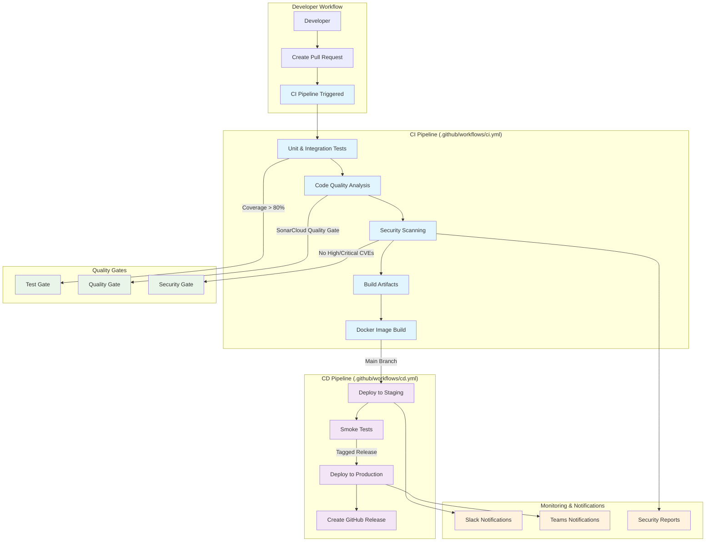

# CI/CD Pipeline Documentation

This document describes the complete CI/CD pipeline setup for the e-Banking Portal Transaction API, including workflows, quality gates, and deployment strategies.

## 🏗️ Pipeline Architecture



## 🔄 Workflow Overview

### 1. Continuous Integration (CI)

**Trigger**: Push to `main`/`develop` branches, Pull Requests
**File**: `.github/workflows/ci.yml`

#### Jobs:
1. **Test & Quality Checks**
   - Runs unit and integration tests with Testcontainers
   - Generates test reports and coverage
   - Uses PostgreSQL service container

2. **Code Quality Analysis**
   - SonarCloud static code analysis
   - Quality gate enforcement
   - Technical debt assessment

3. **Security Scanning**
   - OWASP dependency vulnerability check
   - Trivy filesystem vulnerability scanning
   - SARIF report generation for GitHub Security tab

4. **Build Artifacts**
   - Maven package creation
   - JAR artifact upload
   - Docker image build and push

### 2. Continuous Deployment (CD)

**Trigger**: Push to `main` branch, Tagged releases
**File**: `.github/workflows/cd.yml`

#### Environments:
- **Staging**: Automatic deployment from `main` branch
- **Production**: Manual approval or tagged releases only

#### Jobs:
1. **Deploy to Staging**
   - Kubernetes deployment to staging namespace
   - Smoke tests execution
   - Slack notifications

2. **Deploy to Production**
   - Requires staging success
   - Blue-green deployment strategy
   - Comprehensive health checks
   - GitHub release creation

3. **Rollback** (on failure)
   - Automatic rollback on deployment failure
   - Notification to operations team

### 3. Release Pipeline

**Trigger**: Git tags matching `v*`
**File**: `.github/workflows/release.yml`

#### Features:
- Automated changelog generation
- Multi-architecture Docker builds (AMD64, ARM64)
- Security scanning of release artifacts
- GitHub release with detailed notes
- Team notifications

## 🛡️ Quality Gates

### Code Quality Standards

| Metric | Threshold | Tool |
|--------|-----------|------|
| Line Coverage | > 80% | JaCoCo |
| Branch Coverage | > 70% | JaCoCo |
| Duplicated Lines | < 3% | SonarCloud |
| Code Smells | A Rating | SonarCloud |
| Security Hotspots | 100% Reviewed | SonarCloud |
| Maintainability | A Rating | SonarCloud |

### Security Standards

| Check | Threshold | Tool |
|-------|-----------|------|
| CVSS Score | < 7.0 | OWASP Dependency Check |
| Container Vulnerabilities | No HIGH/CRITICAL | Trivy |
| Secrets Detection | No exposed secrets | GitHub Secret Scanning |

### Build Standards

| Check | Requirement |
|-------|-------------|
| Compilation | Must pass without warnings |
| Tests | All tests must pass |
| Docker Build | Must build successfully |
| Kubernetes Manifests | Must be valid YAML |

## 🔧 Setup Instructions

### 1. GitHub Repository Configuration

#### Required Secrets

```bash
# Docker Registry
DOCKERHUB_USERNAME=your-dockerhub-username
DOCKERHUB_TOKEN=your-dockerhub-token

# Kubernetes Clusters
KUBE_CONFIG_STAGING=base64-encoded-kubeconfig
KUBE_CONFIG_PRODUCTION=base64-encoded-kubeconfig

# Code Quality
SONAR_TOKEN=your-sonarcloud-token

# Notifications
SLACK_WEBHOOK=your-slack-webhook-url
TEAMS_WEBHOOK=your-teams-webhook-url
```

#### Branch Protection Rules

Apply to `main` branch:
- ✅ Require pull request reviews (1 approval)
- ✅ Require status checks: `test`, `code-quality`, `security-scan`
- ✅ Require conversation resolution
- ✅ Include administrators
- ❌ Allow force pushes

### 2. SonarCloud Setup

1. **Create SonarCloud Project**:
   - Visit https://sonarcloud.io
   - Import GitHub repository
   - Note project key and organization

2. **Update CI Configuration**:
   ```yaml
   # In .github/workflows/ci.yml
   -Dsonar.projectKey=your-project-key
   -Dsonar.organization=your-organization
   ```

3. **Configure Quality Gate**:
   - Set coverage threshold to 80%
   - Enable security hotspot review requirement
   - Set maintainability rating to A

### 3. Kubernetes Cluster Preparation

#### Staging Environment
```bash
# Create namespace
kubectl create namespace staging

# Create secrets
kubectl create secret generic txn-secrets \
  --from-literal=DB_PASS=staging-password \
  --from-literal=FX_API_KEY=your-fx-api-key \
  -n staging

# Apply RBAC (if needed)
kubectl apply -f k8s/rbac.yaml -n staging
```

#### Production Environment
```bash
# Create namespace
kubectl create namespace production

# Create secrets
kubectl create secret generic txn-secrets \
  --from-literal=DB_PASS=production-password \
  --from-literal=FX_API_KEY=your-fx-api-key \
  -n production
```

### 4. Docker Registry Setup

```bash
# Create DockerHub repository
docker login
docker buildx create --use

# Test image push
docker build -t your-username/ebanking-transaction-api:test .
docker push your-username/ebanking-transaction-api:test
```

## 📊 Monitoring and Observability

### Pipeline Metrics

Track these metrics for pipeline health:

| Metric | Target | Monitoring |
|--------|--------|------------|
| Build Success Rate | > 95% | GitHub Actions |
| Average Build Time | < 10 minutes | GitHub Actions |
| Test Execution Time | < 5 minutes | GitHub Actions |
| Deployment Frequency | Daily (staging) | GitHub Actions |
| Mean Time to Recovery | < 30 minutes | Manual tracking |

### Alerts and Notifications

#### Slack Notifications
- ✅ Staging deployment success/failure
- ✅ Production deployment success/failure
- ✅ Security vulnerability detection
- ✅ Quality gate failures

#### Teams Notifications
- ✅ Production releases
- ✅ Rollback events
- ✅ Critical security issues

### Dashboard Setup

Consider implementing:
1. **GitHub Actions Dashboard**: Monitor workflow runs
2. **SonarCloud Dashboard**: Track code quality trends
3. **Kubernetes Dashboard**: Monitor application health
4. **Grafana Dashboard**: Application metrics and logs

## 🚀 Deployment Strategies

### Staging Deployment
- **Strategy**: Rolling update
- **Trigger**: Every push to `main`
- **Verification**: Automated smoke tests
- **Rollback**: Automatic on failure

### Production Deployment
- **Strategy**: Blue-green deployment
- **Trigger**: Tagged releases only
- **Verification**: Manual approval + automated tests
- **Rollback**: Manual or automatic on health check failure

### Feature Branches
- **Strategy**: No deployment
- **Verification**: CI pipeline only
- **Merge**: Requires PR approval

## 🔍 Troubleshooting

### Common Issues

#### Build Failures
```bash
# Check logs
gh run list --workflow=ci.yml
gh run view [RUN_ID] --log

# Common fixes
./mvnw clean compile  # Compilation issues
./mvnw dependency:resolve  # Dependency issues
```

#### Test Failures
```bash
# Run tests locally
./mvnw clean test

# Check Testcontainers
docker ps  # Verify containers are running
docker logs [CONTAINER_ID]  # Check container logs
```

#### Docker Build Issues
```bash
# Test local build
docker build -t test-image .
docker run --rm test-image

# Check multi-arch support
docker buildx ls
docker buildx create --use
```

#### Kubernetes Deployment Issues
```bash
# Check deployment status
kubectl get pods -n staging
kubectl describe deployment txn-svc -n staging
kubectl logs -f deployment/txn-svc -n staging

# Check configuration
kubectl get configmap txn-config -n staging -o yaml
kubectl get secret txn-secrets -n staging -o yaml
```

### Pipeline Debugging

#### Enable Debug Logging
```yaml
# Add to workflow
env:
  ACTIONS_RUNNER_DEBUG: true
  ACTIONS_STEP_DEBUG: true
```

#### Check Workflow Syntax
```bash
# Validate workflow files
gh workflow list
gh workflow view ci.yml
```

## 📈 Performance Optimization

### Build Time Optimization
- ✅ Maven dependency caching
- ✅ Docker layer caching
- ✅ Parallel job execution
- ✅ Conditional job execution

### Resource Usage
- **CI Jobs**: 2 CPU, 7GB RAM (GitHub hosted)
- **Build Time**: ~8-12 minutes average
- **Storage**: Artifacts retained for 30 days

### Scaling Considerations
- Use self-hosted runners for heavy workloads
- Implement matrix builds for multiple environments
- Consider workflow parallelization

## 🔄 Maintenance

### Regular Tasks

#### Weekly
- [ ] Review failed builds and fix issues
- [ ] Update dependency versions
- [ ] Check security scan results

#### Monthly
- [ ] Review and update quality gate thresholds
- [ ] Analyze pipeline performance metrics
- [ ] Update documentation

#### Quarterly
- [ ] Review and update CI/CD strategy
- [ ] Evaluate new tools and integrations
- [ ] Conduct pipeline security review

### Upgrades

#### GitHub Actions
- Monitor for new action versions
- Test upgrades in feature branches
- Update runner images regularly

#### Tools and Dependencies
- Keep Maven plugins updated
- Update Docker base images
- Upgrade Kubernetes manifests

## 📚 Resources

### Documentation
- [GitHub Actions Documentation](https://docs.github.com/en/actions)
- [SonarCloud Documentation](https://docs.sonarcloud.io/)
- [Kubernetes Documentation](https://kubernetes.io/docs/)
- [Docker Documentation](https://docs.docker.com/)

### Best Practices
- [CI/CD Best Practices](https://docs.github.com/en/actions/learn-github-actions/workflow-syntax-for-github-actions)
- [Security Best Practices](https://docs.github.com/en/actions/security-guides/security-hardening-for-github-actions)
- [Kubernetes Security](https://kubernetes.io/docs/concepts/security/)

---

This CI/CD setup provides a robust, secure, and scalable pipeline for the e-Banking Portal Transaction API. Regular monitoring and maintenance ensure optimal performance and security.
